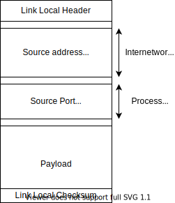
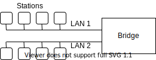
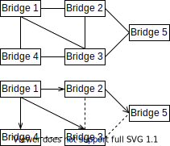

# CSE 222a, Notes

This page contains summaries of the various papers I read as a part of CSE222a, at UCSD. It was taught by Prof. George Porter. The course focused on reading classical and current papers followed by in class discussions. The following are papers that I found interesting. Most of the summaries usually consist of four paragraphs:
1. the introduction, problem its trying to solve, the pain points
2. the idea, how it solves the problem
3. their implementation
4. their results and my thoughts

Some of these papers cannot be uploaded/shared. I have provided links to some of the papers if I was able to find a public link off DuckDuckGo. Else I have provided a private link which needs subscription. In case you cannot access them, send me a mail and if possible I'll share the paper.

### M1.1 Early Internet, Darpa Internet Protocols

These papers describe the structure of an early internet. The first paper is a description of the components in building a packet switching network. The second one, published 14 years later is a description the design goals and the protocols developed.

##### Paper 1. A Protocol for Packet Network Incommunication (IEEE 1974) [[Link](https://www.cs.princeton.edu/courses/archive/fall06/cos561/papers/cerf74.pdf)]

The paper first clearly defines the components of the network viz Hosts, networks and gateways. The hosts as the end points which are connected to each other. Multiple hosts are connected to internetwork. And internetworks are connected via Gateways. Each internetwork can use its own protocol for communication. But communication across internetworks needed a common protocol. The protocol for internetwork communication is the early IP protocol. The authors then describe a protocol over the internetwork protocol to transfer data between end points.

The protocols described are similar to modern implementations of IP and TCP headers. The original vision of the packet switching network remains very similar to our current networks. The paper clearly explains their choice for a common internetwork protocol, while each network was free to develop protocols for communication within the network. Th Gateway simply handled translation between the network protocols. This is very clearly the design that we still adopt, except that hosts very rarely communicate on bare link local protocol. Most communication, even between hosts within a network, is over IP. The authors choice to have a common IP protocol implemented by all hosts which we have acknowledge today as the narrow waist of the internet. Other differences include fragmentation using sequence numbers, which have now moved to TCP, while IP implements a blunt form of fragmentation.

The authors describe the transmission control protocol as a means to transmit a stream of data, which it breaks into segments. Early TCP used the sequence numbers provided by internetwork protocol, and both the protocols worked closely to transmit data. Modern IP and TCP have been separated into distinct protocols with independent functions. The authors also have a section which describes early address format and address assignment which have completely changed. The authors also envision a central repository that provides addresses for each node within a network, which in way the current DHCP implementation.

The paper is a description of the network that the authors envisioned, some of their decisions have formed the basis of the current internet.

##### Paper 2. The Design Philosophy of the DARPA Internet Protocols (ACM 1988) [[Link](https://groups.csail.mit.edu/ana/Publications/PubPDFs/The%20design%20philosophy%20of%20the%20DARPA%20internet%20protocols.pdf)]

The second paper describes the philosophy behind the design of the Internet protocols after the protocols had standardised. The paper first describes the fundamental goals of the network. Then they describe how these goals influence the design.

One of the foremost goals was for the network to and continue working despite loss. This goal was adopted since the network was initially a military project that was later released for civil use. This made the internet fault tolerant at the expense of performance. To achieve this, the state necessary for internet functioning is moved to the endpoints. This approach is described as "fate sharing" since both entity and the state share the same fate. A consequence of this approach was the stateless design of switches and gateways. Also, each end node is responsible for maintaining any state necessary for the connection. It is interesting that the goal and the chosen approach is applied in current network designs.

The paper then describes the services supported over IP and the need for a protocol that allows the user to use the datagram services offered by IP. This created a need for decoupling IP and TCP, and building the User Datagram Protocol as the protocol which offers these services. The paper then describes the division into layers which offer services independently using services offered by lower layers. The classical OSI model is the modern form of this idea, with clear abstractions of the functions provided by each layer.

### M1.2 Distributed Computation of a Spanning Tree in an Extended LAN

##### Paper: An Algorithm for Distributed Computation of a Spanning Tree in an Extended LAN (ACM 1985) [[Link](https://www.it.uu.se/edu/course/homepage/datakom/ht06/slides/sta-perlman.pdf)]

The author describes a algorithm to build a tree from an extended LAN. As networks began to grow, with LANs interconnected using bridges to build an extended LAN, manual configuration of the bridges increased the risk of loops. Similarly a user without proper knowledge could connect LANs with a bridge and create a Loop. The proposed algorithm allows the bridges to exchange data and construct a tree without any additional configuration. Secondly the algorithm converges in O(mesh diameter) while imposing small memory requirements (proportional to the number of LANs the bridge is connected to) on each bridge.

In the final tree, each LAN has a designated bridge. On receiving data from a LAN, a bridge forwards the data to all other LANs on which it is a designated bridge. The complete mesh is transformed into a tree by choosing the designated bridges. The root of the tree is a designated bridge on all of it's LANs. The algorithm chooses a very simple way to choose the root. The bridge with the smallest MAC value is chosen as the root. The bridges exchange HELLO messages to find the root. Once a root is found, the root sends out periodic HELLO messages. These HELLO messages are forwarded on all connected LANs. The bridges based on the HELLO messages share information and choose the designated bridge on each LAN. The algorithm works by each bridge first trying to become the root and then trying to become the designated brigde on each of the LANs it is connected to.

The paper also describes states maintained by the bridge for each LAN and transitions between states to prevent loops due to new bridges being added. Also, the HELLO messages timeout letting the bridge detect failures in the network. This has been described in detail in the paper and I cannot sufficiently describe it in a single paragraph.

Bridge 1 becomes the leader, dotted links are in backup state. Arrows are links in forwarding state, pointing towards non leader bridges.

It is always nice to see a simple distributed algorithm which solves the problem. What is especially refreshing is the poem she wrote as a part of the abstract, which summarises the algorithm succinctly.

*I think that I shall never see*
*A graph more lovely than a tree*

*A tree whose crucial property*
*Is loop-free connectivity.*

*A tree which must be sure to span*
*So packets can reach every LAN.*

*First the Root must be selected*
*By ID it is elected.*

*Least cost paths from Root are traced.*
*In the tree these paths are placed*

*A mesh is made by folks like me*
*Then bridges find a spanning tree.*

### M1.3 Network Protocol Folklore

##### Paper: Network Protocol Folklore (ACM 2019) [[Link](https://ccronline.sigcomm.org/wp-content/uploads/2019/10/acmdl19-336.pdf)]

Radia Perlman, having been working on internet protocols since it's inception, shares a history of choices they made and their consequences on the modern internet implementation. One line from the abstract which makes the paper interesting is: Some decisions have made today’s networks unnecessarily complex and less functional. Surprisingly, mechanisms that were created out of necessity, to compensate for previous decisions, sometimes turn out to be useful for purposes other than the original reason they were invented.

Ethernet addresses were designed to be 6 bytes long so that nodes connected over ethernet would not need any other address configuration. But ethernets never have more than a few thousand nodes attached. Each ethernet address is unique and location independent, but are simply used for link to link transfer. It is interesting that IPv4, which was designed so each node would get a unique address dynamically has a smaller length of just 4 Bytes. People even envisioned ethernet as Layer 3 replacement, implementing end to end connections over ethernet due to the uniqueness property of the ethernet address.

DEC had developed an alternate to IP called IS-IS which adopted CLNP (ConnectionLess Network Protocol) addressing. CNLP has very large 20 Byte addresses ( larger than 16Byte IPv6). Though it did not catch on CNLP supported features that were later built into IPv6.

The paper has a brief overview of the history behind the spanning tree protocol. Customers expected nodes in different ethernets to work. DEC sold routers which routed based on Layer 3 addresses, but expected end nodes to implement Layer 3 to route between different ethernets. The author argues that the right solution was for all endpoints to put Layer 3 into the stack for such inter ethernet communication. But, DEC decided that instead of waiting for endpoints to upgrade, it was easier to build a network box which routed based on ethernet addresses, i.e. the bridge. Radia Perlman was asked to design an algorithm to break ethernet routing loops. The resulting algorithm, the spanning tree algorithm, a temporary fix till endpoints upgrade their network stacks is still being widely deployed.

The paper compares CLNP and modern IPv6. A few features of CLNP are:

- Autoconfiguration by appending 14 byte network prefix with the 6 Byte ethernet address to build a complete 20Byte address.
- The network prefix is hierchically assigned based on region.
- Within an area since the prefix is common, nodes can move anywhere in the area without changing the address.
- Since CLNP had ethernet address, ethernet header could be dropped so CLNP is used for both Layer 2 and 3 routing.

IPv4 addressing was not as scalable as CLNP and does not support movement within an area without address reconfiguration (especially helpful with Datacenters migrating VMs). IP is a flat address space with ethernet providing functionality of a region. One consequence of IP and ethernet being completely independent is that we need the ARP protocol to discover the endnode's ethernet address. CLNP on the other hand needed each node to anounce it's location.

The paper then moves to the final section which are surprising outcomes of the decisions people took.

- Seperation of IP and Ethernet allowed VLAN, which provides the ability to configure which nodes can talk. This is used in datacenters to build a LAN for a group of VMs.
- Since CLNP uses a unique ethernet address which is then announced to everyone, tracking using CLNP would have been easier making it a major privacy issue. Instead since IP is ephemeral, tracking though possible is less intrusive.
- NATs were built to fix IPv4's inability to scale, not necessary for CLNP. But NATs have become a major security feature to obfusicate users behind a NAT. Also since users behind a NAT cannot be contacted without the user initiating a connection, the users are protected from external nodes.

----

### The ones below are incomplete

### M1.4 Classic Multicast Routing

Multicast Routing in Datagram Internetworks and Extended LANs

The paper is the seminal paper on how multicast can be implemented with support from the bridges. The paper proposes minor modifcations to routing algorithms to facilitate multicast.

### M1.5 BGP: Interdomain Routing

eBGP and iBGP, sharing routing information.

### M1.6 End to End Routing Behavior

Radia Perlman

### M1.7 Narada: End System Multicast

Radia Perlman

### M1.8 Active Network Architecture

Radia Perlman

### M1.9 Click Modular Router

Radia Perlman

### M1.10 Open Flow

Radia Perlman

### M1.11 Congestion Avoidance and Control

Reno TCP

### M1.12 Fast Switched Backplane for a Gigabit Switched Router

iSlip

### M1.13 P4: Programming Protocol Independent Packet Processors

p4
M1.14 SWAN

### SWAN: Achieving High Utilization with Software Driven WAN

M1.15 Fat Trees

### scalable commodity data center network arch

### M1.16 PortLand

fault tolerant l2 data center

### M1.17 Jellyfish

### M1.18 DCTCP

### M1.19 MPTCP

### M1.20 Open vSwitch

### M1.21 EyeQ

### M1.22 Censorship in China

great firewall

