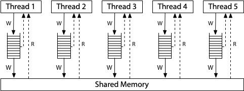

# M3 Memory Models

Notes from:

- [Hardware Memory Models](https://research.swtch.com/hwmm)
- [Programming Language Memory Models](https://research.swtch.com/plmm)
- [Updating the Go Memory Model](https://research.swtch.com/gomm)

---


Memory model decides the visibility and consistency of changes to data stored in memory. The hardware's memory model helps developers understand what the hardware guarantees.

## M3.1 Sequential Consistency

Essentially, if processors are running instructions

1. The order of instructions that a processor runs cannot be re-ordered. i.e. if a processor has instructions `I1, I2, I3` , they must be applied in the same order.

2. Instructions accross processors can interleave in any way while the condition `1` is not violated

Mental model: Threads write to a shared memory, without any caches. Only one thread is allowed to read/write at a time.


## M3.2 x86 Total Store Order (x86-TSO)

All threads are connected to a shared memory, but:

1. each processor queues writes into a local write buffer
2. each checks local write buffer before checking the shared memory.
   1. i.e. a processor sees it writes before others do
3. All processors **agree on the total order of writes** to the shared memory.
   1. corollary:  If we have N reader threads and 1 writer thread, then all the readers MUST see the written value together. i.e. either they  all see the old value or all see the new value.





## M3.4 ARM Relaxed Memory Model

- Each processor reads/writes to its own copy of memory.
- The writes are propagated to other threads independently. Writes can propagate with any reordering.
- But write order is agreed by all the Threads. (i.e. it may happen at different times, but the order is the same)
- Each thread can also postpone a read until after a write. i.e. reordering within a thread's instructions.


## M3.4 Litmus tests

A series of tests to show cases where the memory models differ. In each test, threads read/write to shared values x,y,z... and read to thread local registers r1,r2,... 

##### M3.4.1 Litmus test: Message Passing

```
// Thread 1            // Thread 2
x = 1                     r1 = y
y = 1                     r2 = x
```

Q. Can this program see `r1=1` and `r2=0`?

- Seq Consistency: NO
  - because writes in Thread 1 must happen in the same order
- TSO: NO
  - writes queue guarantees the x write happens before y write.
- ARM: YES


##### M3.4.2 Litmus test: Write Queue

```
// Thread 1            // Thread 2
x = 1                     y = 1
r1 = y                    r2 = x
```

Q. Can this program see `r1 =0` and `r2 = 0`?

- Seq Consistency : NO
  - read to registers can only happen after atleast one of x or y are written.
- TSO: YES
  - if x and y writes are still in the queue, both processors can read old values.
- ARM: YES


##### M3.4.3 Litmus Test: Independent Reads of Independent Writes (IRIW)

```
// Thread 1      // Thread 2      //Thread 3      //Thread 4
x = 1            y = 1            r1 = x          r3 = y
                                  r2 = y          r4 = x
```

Q. Can this program see `r1=1`, `r2=0`, `r3=1` and `r4=0` ?

- Seq Consistency: NO
  - writes to x and y must be appear to all threads in same order.
- TSO: NO
  - write order is agreed by all processors
- ARM: YES


##### M3.4.4 Litmus Test: n6 (Paul Lowenstein)

```
// Thread 1         //Thread 2
x = 1               y = 1
r1 = x              x = 2
r2 = y
```

Q. Can this program see `r1=1`, `r2=0` and `x=1` ?

- Seq Consistency: NO
- TSO: YES
  - x =1 is written, but y=1 and x=2 are still in the write queue.
- ARM: YES


##### M3.4.5 Litmus Test: Load Buffering

```
// Thread 1         // Thread 2
r1 = x              r2 = y
y = 1               x = 1
```

Q. Can program see r1=1, r2=1?

-  Seq Consistency: NO
- TSO: NO
- ARM: YES (can reorder reads)

##### M3.4.6 Litmus Test: Store Buffering

```
// Thread 1            // Thread 2
x = 1                  y = 1
r1 = y                 r2 = x
```

Q. Can the program see r1=0, r2=0?

- Seq Consistent: NO
- x86 TSO: YES
- ARM: YES

##### M3.4.7 Litmus Test: Coherence

```
//Thread 1        //Thread 2        //Thread 3        //Thread 4
x = 1             x = 2             r1 = x            r3 = x
                                    r2 = x            r4 = x
```

Q. Can the prohram see r1=1, r2=2, r3=2, r4=1 ?

- Seq Consistent: NO
- x86 TSO: NO
- ARM: NO

## M3.5 Weak Ordering and Data Race Free Seq. Consistency  (DRF-SC)

- Proposed by Sarita Adve and Mark Hill in “[Weak Ordering – A New Definition](http://citeseerx.ist.psu.edu/viewdoc/summary?doi=10.1.1.42.5567)”.
- synchronization model : a set of constraints on memory accesses to specify how & when synchronization needs to done
- Hardware is weakly ordered w.r.t. a sync model IFF it appears seq. consistent to all software that obeys the sync. model.
- One model that was proposed by the authors is Data-Race-Free (DRF) model.
  - DRF assumes HW has sync operations, other than read/write. 
    - a barrier is a sync-operation
  - Then read/writes can be reordered but cannot be moved across a sync-operation.
- A program is DRF if two memory accesses are:
  - either both reads
  - Or accesses that are separated by sync operations, forcing one to happen before the other
- Weak Ordering: A contract between SW and HW that **If SW is DRF, the HW acts as if it is sequentially consistent.** This was proved by the authors
  - A recipe for HW designers & SW developers to run sequentially consistent programs.


