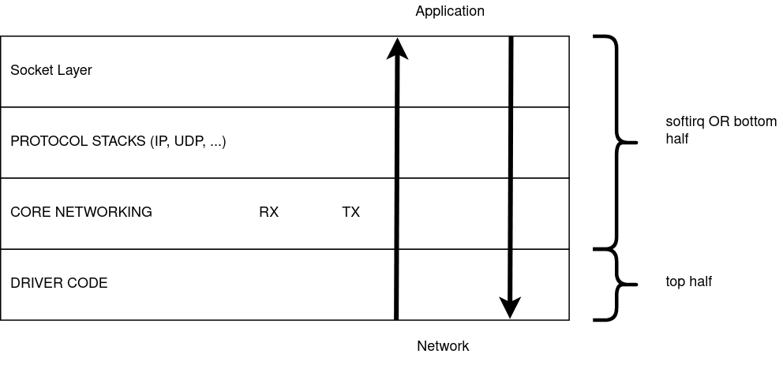

# Linux Networking Notes

This subsection contains my notes on the networking subsystem.

Before we jump in,  notes on how packets are represented in Linux and visualizing their processing.

### N.0.1 Packet Representation in Linux

Packets are represented using sk_buff (socket buffer) in Linux. The struct is declared in `include/linux/skbuff.h`. I will call a packet as skb interchangeably from now on. The sk_buff struct contains two parts, the packet data and it's meta data.

Firstly it contains pointers to the actual data. The actual packet with Ethernet, IP, transport headers and payload that has made it's way over the network will be put in some memory that is allocated. The simplest way this is done is to allocate a contiguous memory block which will contain the whole packet. (We will see in later pages how very large packets can be created using lists of such blocks or how number of data copies can be reduced by having multiple small chunks of data.) skb->head points to the start of the this block, and skb->end points to the end of this block. The whole block need not contain meaningful data. skb->data points to the place where the packet data starts, and skb->tail points to the place where the packet data ends. This allows the packet to have some head room and tail room if the packet needs to expand. These four pointers are used to point to the actual data. They are placed at the end of the sk_buff struct. David Miller's page on [skb_data](http://vger.kernel.org/~davem/skb_data.html) describes skb data in greater detail.

An image from the above page: 

 Additionally the skb contains lots of meta data. Without checking the actual data, a fully filled skb can provide the protocol information, checksum details, it's corresponding socket, etc. The meta data is information that is extracted from the packet data or information attached to the current packet that can be used by all the layers. A few of these fields are explained in David Miller's page [How SKBs work](http://vger.kernel.org/~davem/skb.html).

This is similar to how photographs are saved. One part is the actual image, the second part is meta data like it's dimensions, ISO, aperture, camera model, location information, etc. The meta data by itself is not useful but adds detail to the original data.

I'll add a page which describes the skb and it's fields in greater detail. TODO. 

###  N.0.2 Visualizing Packet Processing

This is not a standard way of visualizing, but I think this is the right way to visualize packet processing and cant visualize in any other way. Receiving packets is in the bottom to top direction. And transmitting packets is in the top to bottom direction. Forwarding to a different layer is left to right.
While receiving packets, drivers receive data first. The bottom most layer where the drivers stay. The drivers hand over the packet to the core network. The core networking code then passes it over to the right protocol stack(s). After the protocol stack processing is done, it enters socket layer, from where the user picks up the packet. 

#### N.0.2.1 Top half and bottom half processing

The path from the driver to the socket queue is divided into two halves.

The top half happens first, the driver gets the raw packet and creates a skb. After an skb is created it calls functions to hand it over to the core networking code. The top half before exiting schedules the bottom half. Top half runs per packet and exits.

The bottom half begins picking up each packet and starts processing them. The packet is passed trough IP, UDP stacks and finally enqueues it into the socket queue. This is done for a bunch of packets. If there are packets that are still pending, the bottom half schedules itself and exits.

IMPORTANT:
1. The top half is below the bottom half in my figure.
2. I can use bottom half OR softirq processing interchangeably.
3. Softirq processing done while receiving packets is also called NET_RX processing. I can use this as well. :)
4. Core network code runs in both these halves. But most of it is in softirq processing. 

With this, basic information we can start describing the RX and TX processing paths.