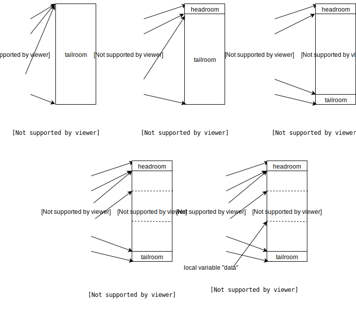

# N3.3-3.4 alloc skb and send_skb

### N3.3 Alloc skb, fill it up (OPTIONAL)

`ip_make_skb()` is called to create a skb and is provided flowi4, sk, msg ptr, msg length and route as  the arguments. This is a generic function that can be called from any tranport layer, here UDP calls it and the argument `tranhdrlen` (transport header length) is equal to sizeof an udp header. Additionally, the length field is equal to the amount of data below the      ip header, i.e. length contains payload length plus udp header length. 

A skb queue head is inited, which      contains a list of skbs. Note that a head itself DOES NOT contain data. It      is a handle to a skb list. On init, the list is empty, with `sk_buff_head->next`      equal to `sk_buff_head->prev` equal to its own address, and `sk_buff_head->qlen`      is zero. Multiple skbs will be added to it if the msg size is greater      than the MTU, forcing IP fragmentation. For now, we will ignore ip fragmentation, so a single skb will be added to it later. 

​      Next `__ip_append_data()` is called to fill in the queue with the skb(s).      The primary goal of `__ip_append_data` is to estimate memory necessary for  the packet(s) and accordingly create and enqueue skb(s) into the queue.  The skb needs memory necessary to accommodate:

1. link layer headers: each device during init sets `dev->hh_len`. Hardware header length (usually represented by var `hh_len`) is the maximum space the driver will need to fill in header(s) below the network header. e.g. ethernet header is added by ethernet drivers.
2. IP and UDP headers. The function also handles the case where the packet needs IP fragmentation. In that case, additional logic to allocate memory for fragmentation headers is necessary.
3. Payload. Obviously.

Additionally some extra tail space is also      provided while allocating the skb. The allocation logic is shown in the      code below. Once  the calculation is done, `sock_alloc_send_skb()` is called, which internally  calls `sock_alloc_send_pskb()` to allocate the skb. Each skb must be accounted for in the sock where it was created (TX) or in the sock where it is destined to (RX). This is to control the memory used by packets. Each sock will have restrictions on the amount of memory it can use. In this case `wmem`, the amount of data written into the socket that hasn't transmitted yet, is a constraint      while allocating data. If      wmem is full, `sendmsg()` call can get blocked (unless the socket is set to non blocking mode) till sock memory is freed. Once data is allocated, the  udp payload data is written into the skb. `skb->transport_header` and `skb->network_header` are set. IP and UDP headers haven't been filled yet, but pointers to where they have to be  filled are set. The skb is added to the skb queue and finally sock wmem is updated.      

Next __ip_make_skb() will fill in ip header. (ignore fragmentation code for now, which will run if the queue has more than one skb). Finally it returns the created skb's pointer. 

```c
struct sk_buff *ip_make_skb()
{
    struct sk_buff_head queue;
    __skb_queue_head_init(&queue);

    err = __ip_append_data()
    {
        hh_len = LL_RESERVED_SPACE(rt->dst.dev);

        fragheaderlen = sizeof(struct iphdr) + (opt ? opt->optlen : 0);
        // opt is NULL, fragheaderlen is equal to sizeof(struct iphdr)

        datalen = length + fraggap; //fraggap is zero
        // length = udphdr len + payload length
        fraglen = datalen + fragheaderlen;

        alloclen = fraglen;
        skb = sock_alloc_send_skb(sk,
                alloclen + hh_len + 15,
                (flags & MSG_DONTWAIT), &err);// ------- Step 0

        skb_reserve(skb, hh_len);  // -------------------------- Step 1
        data = skb_put(skb, fraglen + exthdrlen - pagedlen);
        // exthdrlen & pagedlen are zero.  --------------------- Step 2
        skb_set_network_header(skb, exthdrlen);
        skb->transport_header = (skb->network_header +
                fragheaderlen); // --------------------- Step 3

        data += fragheaderlen + exthdrlen; // ------------------ Step 4
        // move pointer to where payload starts
        copy = datalen - transhdrlen - fraggap - pagedlen;
        // amount of payload data that needs to be copied.
        // datalen = payload len + udp header len.
        // transhdrlen = udp header len

        getfrag(from, data + transhdrlen, offset, copy, fraggap, skb);
        // getfrag is set to ip_generic_getfrag()
        {    //copy and update csum
            csum_and_copy_from_iter_full(to, len, &csum, &msg->msg_iter);
            skb->csum = csum_block_add(skb->csum, csum, odd);
        }

        length -= copy + transhdrlen; // copied length is subtracted

        skb->sk = sk;
        __skb_queue_tail(queue, skb);

        refcount_add(wmem_alloc_delta, &sk->sk_wmem_alloc);
    }

    return __ip_make_skb(sk, fl4, &queue, cork)
    {
        skb = __skb_dequeue(queue);

        iph = ip_hdr(skb);
        iph->version = 4;
        iph->ihl = 5;
        iph->tos = (cork->tos != -1) ? cork->tos : inet->tos;
        iph->frag_off = df;
        iph->ttl = ttl;
        iph->protocol = sk->sk_protocol;
        ip_copy_addrs(iph, fl4); // copy addresses from flow info
    }
} 
```

####  N3.3.1 (Older?) Skb allocation logic

The figure below which shows how pointers in skb meta data are being updated corresponding to steps commented in the code above. These pictures are from  [davem's skb_data page](http://vger.kernel.org/~davem/skb_data.html) which describes udp packet data being filled in a skb. This logic is very different from what I have described above. It is possible that this was the allocation logic earlier. It is entirely possible I have missed something. Comments are welcome.



#### 3.4 UDP and IP send_skb

​      `udp_send_skb()` is simple, it fills in the UDP header, computes the checksum (`csum`),      and sends the skb to `ip_send_skb()`. If ip_send_skb returns an error,      SNMP value SNDBUFERRORS is incremented. And if everything goes well OUTDATAGRAMS      is incremented.    

`ip_send_skb()` calls `ip_local_out()`, which calls `__ip_local_out()` The packet      then enters the OUTPUT chain, at the end of which `dst_output()` is called.      On finding the packet's route, `skb_dst(dst)->output` is set to `ip_output`.

The skb then enters the POSTROUTING chain, at the end of which `ip_finish_output()`      is called. `ip_finish_output()` checks if the packet needs fragmentation (in  certain cases, the packet might have modified or the packet route might change, which may require ip fragmentation). Ignoring the fragmentation, `ip_finish_output2()` is called.    

```
		            transport layer (TCP/UDP)

					                        🠗       __ip_local_out()
                                          OUTPUT
		      INPUT                         🠗       dst_output()
		        |                           |
		ROUTING DECISION --- FORWARDING --- +
		        |                           |
		    PREROUTING                      🠗       ip_output()
		        |                      POSTROUTING
		                                    🠗       ip_finish_output() 

		             CORE NETWORKING 
```

​      `ip_finish_output2()` first checks if the interface the packet is being  routed out to has a corresponding neighbour entry (`neigh`). The neighbour subsystem is how the kernel manages link local connections corresponding to IP addresses. i.e. ARP to manage ipv4 addresses and NDISC for ipv6 addresses. If the next hop for an interface is not known, the corresponding messages      are triggered, and is added to the corresponding cache. The current arp      cache can be checked by printing `/proc/net/arp`. For now, the assuming      the neigh can be found, we will proceed. `neigh_output` is called, which      calls `neigh_hh_output()`. (An output function is registered in the neigh entry, which will be called if the neigh entry has expired. Ignoring this for now.)

​     `neigh_hh_output()` adds the hardware header necessary into the headroom. The neigh entry contains a cached hardware header, which is added while      adding a neigh entry into the neigh cache (after a successful ARP resolution      or neighbour discovery) is complete. More of this will be covered in a      separate page covering the neigh subsystem.

Now the skb has all necessary headers, pass it to the core networking subsystem which will let the driver send the packet out.    

```
static int ip_finish_output2()
{
    neigh = __ipv4_neigh_lookup_noref(dev, nexthop);
    neigh_output(neigh, skb)
    {
        hh_alen = HH_DATA_ALIGN(hh_len); //align hard header
        memcpy(skb->data - hh_alen, hh->hh_data,
                hh_alen);
    }
    __skb_push(skb, hh_len); // add the hh header
    return dev_queue_xmit(skb);
} 
```